# Azure Container Apps Security Architecture - WAF-Compliant Design

This diagram illustrates the security improvements applied to the Azure Container Apps infrastructure following Well-Architected Framework (WAF) best practices.

## Architecture Diagram

```mermaid
graph TB
    subgraph Internet["🌐 Internet"]
        User[("👤 User/Client")]
    end
    
    subgraph Azure["☁️ Azure Cloud"]
        subgraph ResourceGroup["Resource Group"]
            
            subgraph Monitoring["📊 Monitoring & Security"]
                LAW["📝 Log Analytics Workspace<br/>✅ Diagnostic Logs<br/>✅ 30-day Retention"]
                Defender["🛡️ Microsoft Defender<br/>✅ Container Scanning<br/>✅ Threat Detection"]
            end
            
            subgraph VNet["🔒 Virtual Network (10.0.0.0/16)"]
                
                subgraph InfraSubnet["Infrastructure Subnet<br/>(10.0.0.0/23)"]
                    CAE["🏗️ Container Apps Environment<br/>✅ Internal Mode Only<br/>✅ Zone Redundant<br/>✅ Peer Traffic Encrypted<br/>✅ Private VNET Integration"]
                    
                    subgraph ContainerApps["Container Apps"]
                        CA1["📦 MCP AVM Modules Server<br/>✅ Internal Ingress<br/>✅ HTTPS Only<br/>✅ Managed Identity Auth"]
                        CA2["📦 MCP Azure Pricing Server<br/>✅ Internal Ingress<br/>✅ HTTPS Only<br/>✅ Managed Identity Auth"]
                    end
                end
                
                subgraph PESubnet["Private Endpoint Subnet<br/>(10.0.2.0/24)"]
                    PE_ACR["🔐 Private Endpoint<br/>for ACR"]
                end
                
                PrivateDNS["🌐 Private DNS Zone<br/>privatelink.azurecr.io"]
            end
            
            ACR["🐳 Container Registry (Premium)<br/>✅ Admin User Disabled<br/>✅ Public Access Disabled<br/>✅ Quarantine Policy Enabled<br/>✅ Soft Delete Enabled<br/>✅ Managed Identity Auth<br/>✅ Private Endpoint Only"]
            
            MI["🆔 User-Assigned<br/>Managed Identity<br/>✅ No Credentials<br/>✅ RBAC: AcrPull"]
            
            KeyVault["🔑 Azure Key Vault<br/>(Optional)<br/>✅ Secrets Management<br/>✅ Certificate Storage"]
        end
    end
    
    subgraph Legend["🎨 Security Improvements Legend"]
        L1["🔴 Before: Public Exposure"]
        L2["🟢 After: Private Network"]
        L3["🔴 Before: Admin Credentials"]
        L4["🟢 After: Managed Identity"]
        L5["🔴 Before: No Encryption"]
        L6["🟢 After: Encrypted Traffic"]
        L7["🔴 Before: No Monitoring"]
        L8["🟢 After: Full Diagnostics"]
    end
    
    %% Connections
    User -.->|"❌ Direct Access Blocked"| CAE
    User -->|"✅ Controlled Access<br/>(via App Gateway/Front Door)"| VNet
    
    CAE --> CA1
    CAE --> CA2
    
    CA1 -.->|"🔒 Pull Images via<br/>Managed Identity"| PE_ACR
    CA2 -.->|"🔒 Pull Images via<br/>Managed Identity"| PE_ACR
    
    PE_ACR -->|"🔐 Private Link"| ACR
    PE_ACR -.->|"DNS Resolution"| PrivateDNS
    
    MI -.->|"🆔 Identity Provider"| CA1
    MI -.->|"🆔 Identity Provider"| CA2
    MI -->|"RBAC: AcrPull Role"| ACR
    
    CAE -->|"📊 Diagnostic Logs"| LAW
    CA1 -->|"📊 Diagnostic Logs"| LAW
    CA2 -->|"📊 Diagnostic Logs"| LAW
    ACR -->|"📊 Diagnostic Logs"| LAW
    
    ACR -.->|"🛡️ Image Scanning"| Defender
    
    KeyVault -.->|"🔑 Secrets & Certs"| CA1
    KeyVault -.->|"🔑 Secrets & Certs"| CA2
    
    %% Styling
    classDef secure fill:#2ecc71,stroke:#27ae60,stroke-width:3px,color:#fff
    classDef monitoring fill:#3498db,stroke:#2980b9,stroke-width:2px,color:#fff
    classDef network fill:#9b59b6,stroke:#8e44ad,stroke-width:2px,color:#fff
    classDef identity fill:#f39c12,stroke:#e67e22,stroke-width:2px,color:#fff
    classDef optional fill:#95a5a6,stroke:#7f8c8d,stroke-width:2px,color:#fff,stroke-dasharray: 5 5
    
    class ACR,PE_ACR,CA1,CA2,CAE secure
    class LAW,Defender monitoring
    class VNet,InfraSubnet,PESubnet,PrivateDNS network
    class MI identity
    class KeyVault optional
```

## Security Improvements Overview

### 🔒 Network Security
| Control | Before | After |
|---------|--------|-------|
| **Container Apps Exposure** | Public (`external: true`) | Internal VNet only |
| **ACR Access** | Public with admin user | Private endpoint only |
| **HTTPS Enforcement** | `allowInsecure: true` | HTTPS only, HTTP redirected |
| **Network Isolation** | None | VNet integration with subnets |
| **DNS Resolution** | Public DNS | Private DNS zones |

### 🆔 Identity & Access Management
| Control | Before | After |
|---------|--------|-------|
| **ACR Authentication** | Admin user credentials | Managed Identity with AcrPull RBAC |
| **Container App Identity** | Not configured | User-assigned managed identity |
| **Credential Management** | Hardcoded/exposed | Azure-managed, zero credentials |
| **RBAC** | Manual/broad permissions | Least privilege with specific roles |

### 🔐 Encryption & Data Protection
| Control | Before | After |
|---------|--------|-------|
| **Data at Rest** | Default encryption | System-managed keys (can upgrade to CMK) |
| **Data in Transit** | HTTP allowed | HTTPS enforced, peer traffic encrypted |
| **Container Traffic** | Unencrypted | Peer-to-peer encryption enabled |
| **Secrets Storage** | Environment variables | Key Vault integration (optional) |

### 📊 Monitoring & Compliance
| Control | Before | After |
|---------|--------|-------|
| **Diagnostic Logs** | None | Enabled for all resources |
| **Log Retention** | N/A | 30 days in Log Analytics |
| **Threat Detection** | None | Microsoft Defender for Containers |
| **Image Scanning** | None | Quarantine policy enabled |
| **Audit Trail** | Limited | Comprehensive via Log Analytics |

### 🏗️ Reliability & Resilience
| Control | Before | After |
|---------|--------|-------|
| **Zone Redundancy** | Single zone | Zone-redundant deployment |
| **Soft Delete** | Disabled | Enabled (7-day retention) |
| **Retention Policy** | Disabled | Enabled (7-day retention) |
| **High Availability** | Basic | Premium tier with replication |

## Azure Well-Architected Framework Alignment

### ✅ Security Pillar
- **SE:01** - Security baseline established with Azure Policy
- **SE:02** - Identity and access management with managed identities
- **SE:04** - Network segmentation with VNet integration
- **SE:06** - Data encryption at rest and in transit
- **SE:07** - Monitoring and threat detection enabled
- **SE:08** - Secure development lifecycle with image scanning

### ✅ Reliability Pillar
- **RE:05** - Zone redundancy for high availability
- **RE:07** - Self-healing with Container Apps auto-restart
- **RE:09** - Disaster recovery with soft delete and retention

### ✅ Operational Excellence Pillar
- **OE:04** - Comprehensive monitoring with Log Analytics
- **OE:07** - Infrastructure as Code with AVM modules
- **OE:11** - Diagnostic and audit logging enabled

## Implementation Notes

### Prerequisites
1. Azure subscription with appropriate permissions
2. VNet with sufficient address space
3. Premium SKU for Container Registry (required for private endpoints)
4. Log Analytics workspace for centralized logging

### Deployment Steps
1. Deploy Virtual Network with subnet configuration
2. Deploy Log Analytics Workspace
3. Deploy Managed Identity
4. Deploy Container Registry with private endpoint
5. Deploy Container Apps Environment (internal mode)
6. Deploy Container Apps with managed identity authentication

### Cost Optimization
- **Container Registry**: Premium tier adds ~$20/day but required for security features
- **VNet**: No additional cost for VNet itself
- **Private Endpoints**: ~$0.01/hour per endpoint
- **Zone Redundancy**: Approximately 2-3x compute costs for resilience
- **Log Analytics**: Pay-per-GB ingested (typically $2.30/GB)

### Security Checklist
- [ ] Admin user disabled on Container Registry
- [ ] Public network access disabled on Container Registry
- [ ] Private endpoints configured and DNS resolution working
- [ ] Managed identity assigned to Container Apps
- [ ] RBAC configured (AcrPull role)
- [ ] HTTPS-only ingress configured
- [ ] Internal ingress mode enabled
- [ ] Diagnostic settings enabled on all resources
- [ ] Microsoft Defender for Containers enabled
- [ ] Quarantine policy enabled for vulnerable images
- [ ] Soft delete and retention policies configured
- [ ] Zone redundancy enabled
- [ ] Peer traffic encryption enabled

## References

- [Azure Well-Architected Framework - Security](https://learn.microsoft.com/azure/well-architected/security/)
- [Container Apps Security Best Practices](https://learn.microsoft.com/azure/container-apps/security)
- [Container Registry Security Baseline](https://learn.microsoft.com/security/benchmark/azure/baselines/azure-container-registry-security-baseline)
- [Azure Verified Modules](https://azure.github.io/Azure-Verified-Modules/)

---

**Document Version**: 1.0  
**Last Updated**: December 8, 2025  
**Status**: Production-Ready
