# Azure Private Load Balancer with 3 VMs Architecture

## Architecture Diagram

```mermaid
flowchart TB
    subgraph Azure["Azure Cloud"]
        subgraph VNet["Virtual Network (10.0.0.0/16)"]
            subgraph SubnetLB["Load Balancer Subnet (10.0.1.0/24)"]
                ILB[("🔄 Internal Load Balancer<br/>Private IP: 10.0.1.10")]
            end
            
            subgraph SubnetVM["VM Subnet (10.0.2.0/24)"]
                VM1["🖥️ VM-1<br/>10.0.2.4"]
                VM2["🖥️ VM-2<br/>10.0.2.5"]
                VM3["🖥️ VM-3<br/>10.0.2.6"]
            end
        end
    end
    
    Client["🏢 On-Premises / Private Client"]
    
    Client -->|"Private Connection"| ILB
    ILB -->|"Backend Pool"| VM1
    ILB -->|"Backend Pool"| VM2
    ILB -->|"Backend Pool"| VM3

    style Azure fill:#0078D4,stroke:#005A9E,color:#fff
    style VNet fill:#E6F2FF,stroke:#0078D4
    style SubnetLB fill:#FFF4CE,stroke:#FFC107
    style SubnetVM fill:#D4EDDA,stroke:#28A745
    style ILB fill:#FFE6CC,stroke:#FF9800
    style VM1 fill:#CCE5FF,stroke:#0078D4
    style VM2 fill:#CCE5FF,stroke:#0078D4
    style VM3 fill:#CCE5FF,stroke:#0078D4
    style Client fill:#F8F9FA,stroke:#6C757D
```

## Architecture Components

| Component | Description |
|-----------|-------------|
| **Internal Load Balancer** | Azure Standard Load Balancer (Private/Internal) - distributes traffic across VMs |
| **VM-1, VM-2, VM-3** | Virtual Machines in the backend pool |
| **Virtual Network** | Private network hosting all resources |
| **LB Subnet** | Dedicated subnet for load balancer frontend IP |
| **VM Subnet** | Subnet containing the backend VM pool |

## Key Characteristics

- **Private Access Only**: No public IP - traffic originates from within Azure or connected networks (VPN/ExpressRoute)
- **High Availability**: Load balancer distributes traffic across 3 VMs
- **Health Probes**: LB monitors VM health and routes traffic only to healthy instances
- **Zone Redundancy**: Can be configured across Availability Zones for 99.99% SLA

## Network Configuration

| Resource | Address Space / IP |
|----------|-------------------|
| Virtual Network | 10.0.0.0/16 |
| LB Subnet | 10.0.1.0/24 |
| VM Subnet | 10.0.2.0/24 |
| Load Balancer Frontend IP | 10.0.1.10 |
| VM-1 | 10.0.2.4 |
| VM-2 | 10.0.2.5 |
| VM-3 | 10.0.2.6 |

## Load Balancer Configuration

- **SKU**: Standard
- **Type**: Internal (Private)
- **Frontend IP**: Static private IP (10.0.1.10)
- **Backend Pool**: 3 VMs
- **Health Probe**: TCP/HTTP probe on application port
- **Load Balancing Rule**: Distributes traffic based on 5-tuple hash (default)
