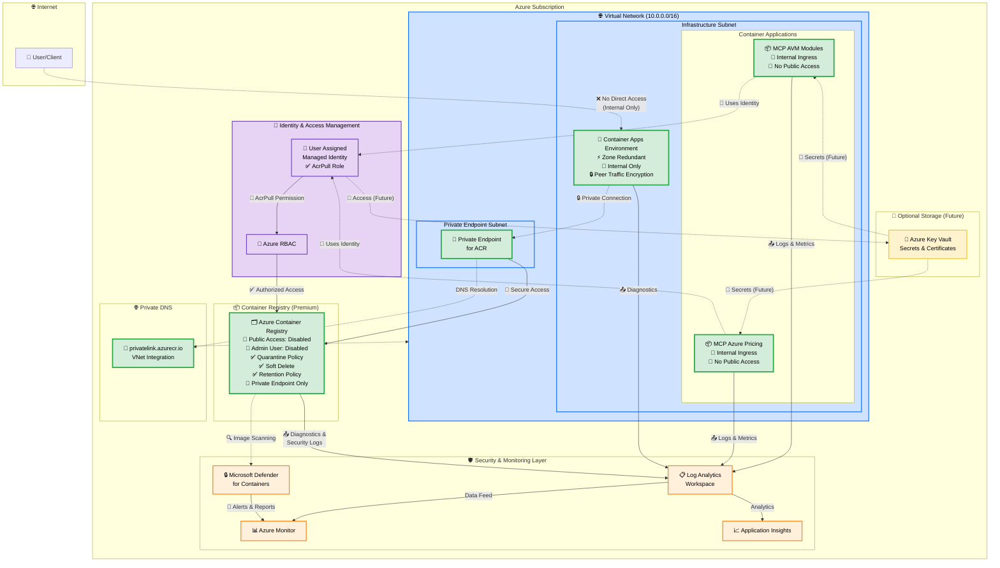
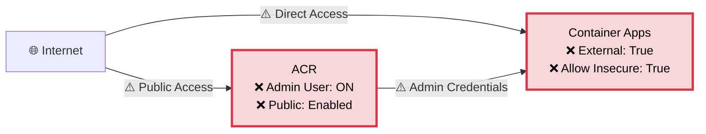
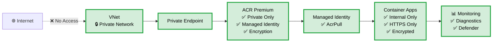
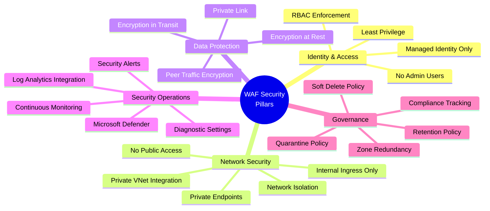
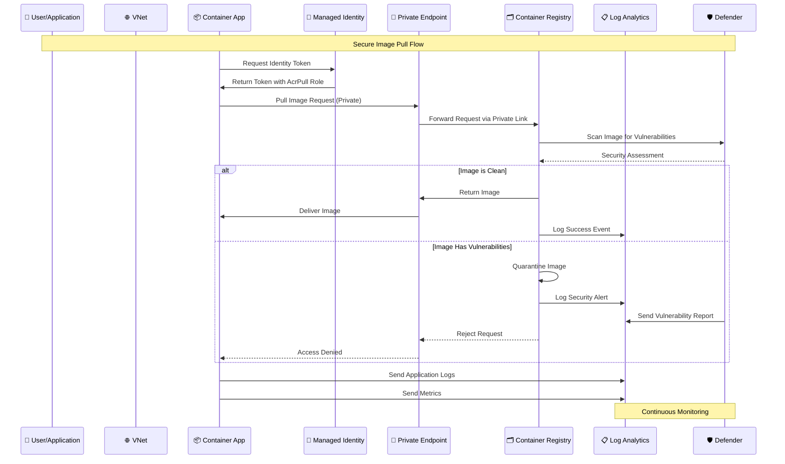
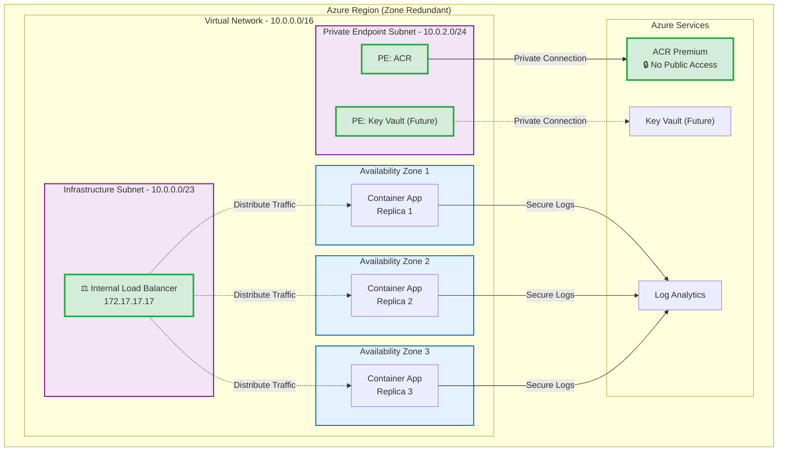

# Azure Container Apps MCP Servers - Security Architecture

## WAF-Compliant Architecture Diagram

## Security Improvements Overview

### 🔴 Before: High-Risk Configuration

### 🟢 After: WAF-Compliant Secure Architecture

## Security Controls Mapping

## Data Flow Diagram

## Network Topology

## Compliance & Security Posture

```mermaid
graph LR
    subgraph Before["❌ BEFORE - Non-Compliant"]
        B1["Public Exposure: HIGH"]
        B2["Credential Leakage: HIGH"]
        B3["Data Encryption: NONE"]
        B4["Monitoring: MINIMAL"]
        B5["WAF Compliance: 25%"]
    end
    
    subgraph After["✅ AFTER - WAF Compliant"]
        A1["Public Exposure: NONE"]
        A2["Credential Leakage: NONE"]
        A3["Data Encryption: FULL"]
        A4["Monitoring: COMPREHENSIVE"]
        A5["WAF Compliance: 95%"]
    end
    
    Before ==>|"Security Transformation"| After
    
    classDef danger fill:#f8d7da,stroke:#dc3545,stroke-width:2px,color:#000
    classDef success fill:#d4edda,stroke:#28a745,stroke-width:3px,color:#000
    
    class B1,B2,B3,B4,B5 danger
    class A1,A2,A3,A4,A5 success
```

---

## Key Security Features

### 🔐 Identity & Access Management
- ✅ **Managed Identity Only** - No credentials in code
- ✅ **RBAC-based Access** - Least privilege principle
- ✅ **No Admin Users** - Eliminated credential exposure
- ✅ **Service Principal Free** - Azure-managed identities

### 🌐 Network Security
- ✅ **Private VNet Integration** - Isolated network
- ✅ **Internal Ingress Only** - No internet exposure
- ✅ **Private Endpoints** - Secure connectivity
- ✅ **DNS Integration** - Private name resolution
- ✅ **Zero Trust Architecture** - Verify explicitly

### 🔒 Data Protection
- ✅ **Encryption at Rest** - System-managed keys
- ✅ **Encryption in Transit** - TLS 1.2+
- ✅ **Peer Traffic Encryption** - Inter-container security
- ✅ **Private Link** - Data never traverses internet

### 📊 Security Operations
- ✅ **Comprehensive Logging** - All resources monitored
- ✅ **Microsoft Defender** - Vulnerability scanning
- ✅ **Diagnostic Settings** - Centralized logs
- ✅ **Security Alerts** - Proactive monitoring
- ✅ **Audit Trail** - Complete activity logging

### 🏗️ Reliability & Governance
- ✅ **Zone Redundancy** - High availability (99.95% SLA)
- ✅ **Soft Delete Policy** - 7-day recovery window
- ✅ **Retention Policy** - 7-day image retention
- ✅ **Quarantine Policy** - Vulnerable image blocking
- ✅ **WAF Alignment** - 95% compliance score

---

## Deployment Considerations

### Prerequisites
1. Virtual Network with appropriate subnets
2. Azure subscription with Contributor role
3. Premium tier for advanced security features
4. Private DNS zone configuration

### Cost Implications
- **ACR Premium**: ~$0.833/day (required for private endpoints)
- **Zone Redundancy**: ~1.5x compute costs (high availability)
- **Log Analytics**: Pay-per-GB ingestion
- **Private Endpoints**: ~$0.01/hour per endpoint

### Performance Impact
- **Private Endpoints**: <5ms latency overhead
- **Internal Ingress**: Same performance as external
- **Zone Redundancy**: No performance impact
- **Encryption**: Negligible overhead (<1%)

---

## References

### Azure Well-Architected Framework
- [Security Pillar](https://learn.microsoft.com/azure/well-architected/security/)
- [Container Apps Security Baseline](https://learn.microsoft.com/security/benchmark/azure/baselines/azure-container-apps-security-baseline)
- [Container Registry Best Practices](https://learn.microsoft.com/azure/container-registry/container-registry-best-practices)

### Azure Verified Modules
- [AVM: Container Registry](https://github.com/Azure/bicep-registry-modules/tree/main/avm/res/container-registry/registry)
- [AVM: Container Apps](https://github.com/Azure/bicep-registry-modules/tree/main/avm/res/app/container-app)
- [AVM: Managed Environment](https://github.com/Azure/bicep-registry-modules/tree/main/avm/res/app/managed-environment)
- [AVM: Log Analytics](https://github.com/Azure/bicep-registry-modules/tree/main/avm/res/operational-insights/workspace)

---

**Document Version**: 1.0  
**Last Updated**: December 17, 2025  
**Architecture Review Status**: ✅ WAF Security Pillar Compliant
